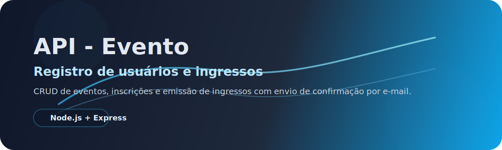
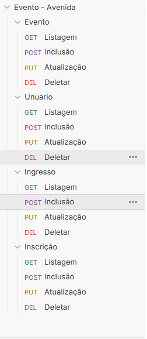

<p align="center">
  
</p>

# API - Evento / registro de usuarios e ingressos

API REST para gerenciamento de eventos, ingressos, usuários e inscrições. O projeto permite cadastrar eventos, registrar inscrições, controlar a quantidade de ingressos por evento e enviar e-mail de confirmação após a inscrição.

## Funcionalidades

- Cadastro, listagem, atualização e exclusão de eventos
- Cadastro, listagem, atualização e exclusão de ingressos
- Cadastro, listagem, atualização e exclusão de inscrições
- Controle de quantidade de ingressos por evento
- Envio de e-mail de confirmação para o usuário inscrito

## Tecnologias

- Node.js
- Express
- TypeScript
- Prisma
- MySQL
- Zod
- Nodemailer

## Como executar

1. Instale as dependências:

```bash
npm install
```

2. Configure o arquivo `.env` com as variáveis do banco e do Mailtrap.

3. Rode as migrations e gere o client do Prisma, se necessário:

```bash
npx prisma migrate dev
npx prisma generate
```

4. Inicie a aplicação:

```bash
npm run dev
```

## Endpoints principais

- `GET /eventos`
- `POST /eventos`
- `PUT /eventos/:id`
- `DELETE /eventos/:id`
- `GET /ingresso`
- `POST /ingresso`
- `PUT /ingresso/:id`
- `DELETE /ingresso/:id`
- `GET /inscricao`
- `POST /inscricao`
- `PUT /inscricao/:id`
- `DELETE /inscricao/:id`

<p align="center">
  
</p>

## Exemplo de inscrição

```json
{
  "eventoId": 1,
  "usuarioId": 1,
  "ingressoId": 1
}
```

## Observações

- O envio de e-mail usa o host `sandbox.smtp.mailtrap.io`.
- O estoque do evento é reduzido quando uma inscrição é criada.
- Ao excluir uma inscrição, a quantidade de ingressos é restaurada.
